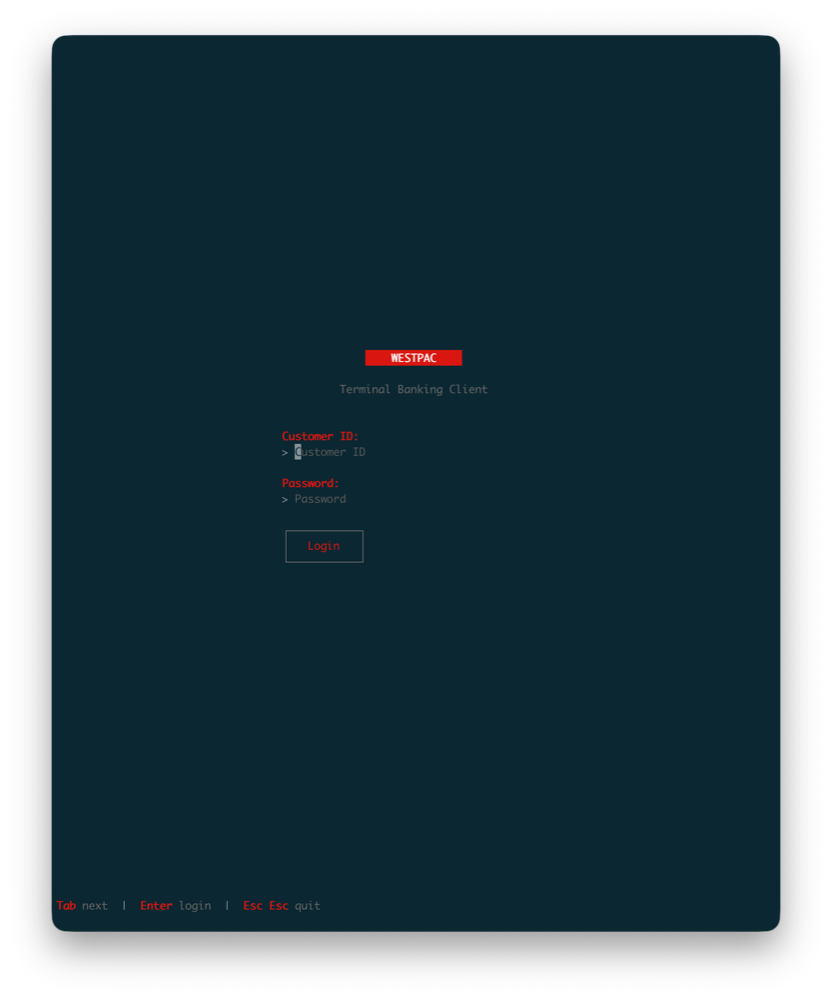
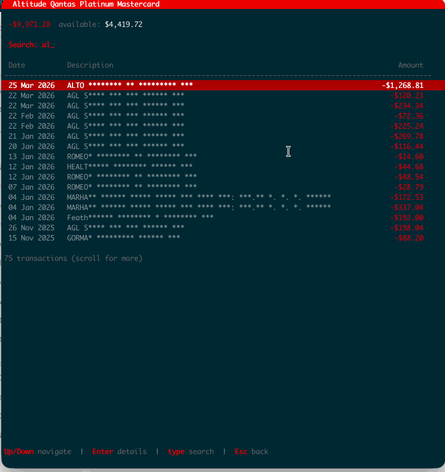

#  westpac-cli

Unofficial Terminal client for [Westpac](https://www.westpac.com.au/) banking. Built with Go and [Bubbletea](https://github.com/charmbracelet/bubbletea).

<p align="center">
  
</p>

## Features

- **Login** with Customer ID and password
- **Account overview** with balances and totals
- **Transaction list** with infinite scroll and inline search
- **Transaction details** with merchant info (name, address, phone, website, map coordinates)
- **Financial summary** - net worth and spend analysis
- **Merchant logos** via Kitty graphics protocol
- **Copy to clipboard** - press `C` on transaction detail
- **Mask mode** (`--mask`) - hide sensitive data for screen sharing
- **Session persistence** - persistent login across restarts

## Flow

<p align="center">
  
</p>

## Install

```bash
go install github.com/noma4i/westpac-cli@latest
```

Or build from source:

```bash
git clone https://github.com/noma4i/westpac-cli.git
cd westpac-cli
go build -o westpac-cli .
```

## Usage

```bash
./westpac-cli              # normal mode
./westpac-cli --debug      # with debug logging
./westpac-cli --mask       # hide sensitive data
./westpac-cli --mask --debug
```

## Navigation

| Key | Action |
|-----|--------|
| Up/Down, j/k | Navigate lists |
| Enter | Select / view details |
| Esc | Go back |
| Esc Esc | Quit |
| Tab | Switch between Accounts and Summary |
| R | Refresh current screen |
| L | Logout |
| C | Copy transaction details |
| Type any key | Search transactions |

## Config

Session and debug logs are stored in `~/.config/westpac/`.

## Tech

- [Bubbletea](https://github.com/charmbracelet/bubbletea) - TUI framework
- [Lipgloss](https://github.com/charmbracelet/lipgloss) - styling
- [Kitty graphics protocol](https://sw.kovidgoyal.net/kitty/graphics-protocol/) - merchant logos

## Inspired by

[sbb-tui](https://github.com/Necrom4/sbb-tui) - terminal client for Swiss railways
